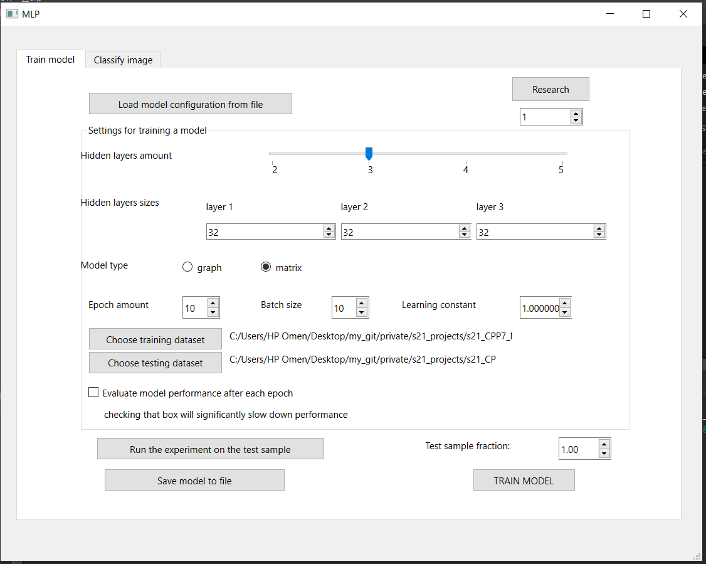
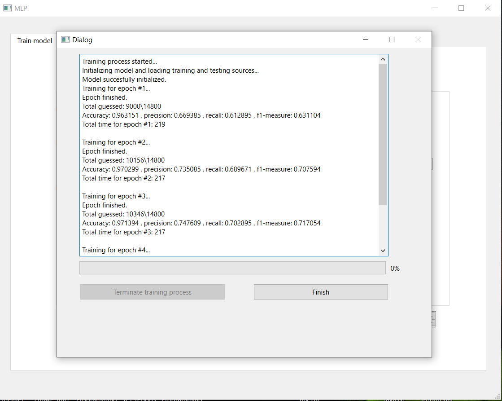
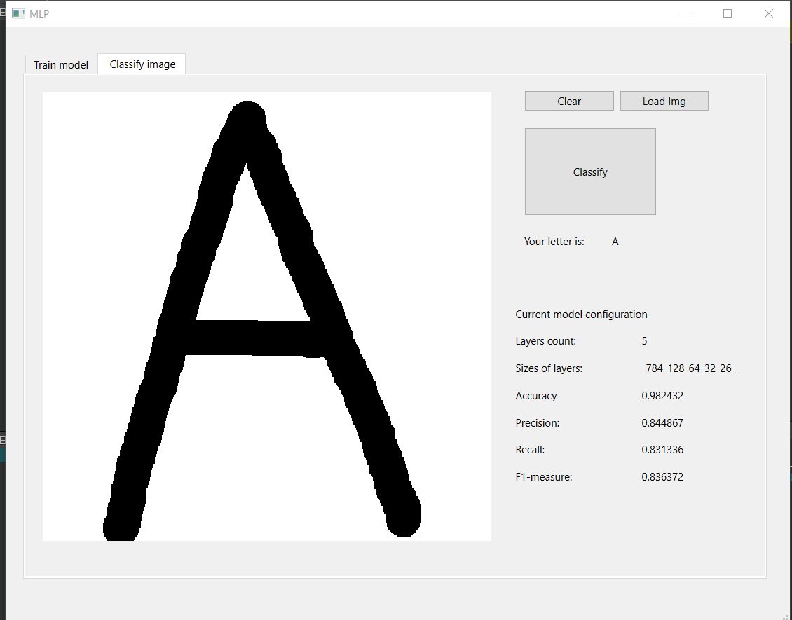

# MLP
Multilayer Perception Model (fully connected neural network). C++, QT.
## About project
This GUI application allowes to train multilayer perception model on EMNIST database. Settings for the training process, such as learning constant, batch size, hidden layers sizes and amount of epoches, can be specified by the user. Perception model for training process is written in C++. 
Perception model trained by this application on EMNIST database can achieve accuracy as high as 99.9% on letter classification task.
## Build instructions
Project requires QT libraries installed.
### Linux/Mac
1. move to the src/MLP directory
3. run "make install"
### Windows
1. move to the build directory
2. run "cmake -S path_to_cmakelist.txt -B path_to_build"
3. run "cmake --build . --config Release"
### Application overview
## Train model tab

- Before starting the training process, testing and training datasets should be loaded by clicking respective buttons. These datasets are located in "datasets" folder.
- User can specify settings as he wishes and start training process by clicking "TRAIN MODEL" button. After that, dialog window will be shown with information about progress of training process. If "evaluate model after each epoch" checkbox will be turned on, info dialog window will show evaluated performance of the model after each epoch. Training process can take from few minutes to few hours, depending on computational power of the device and specified settings, such us hidden layers sizes.
- User can save trained model to a file, or load trained model from a file, by clicking "Load model configuration from a file" or "Save model file" buttons.
## Info dialog window

- This window will be shown after "TRAIN MODEL" button will be clicked. It displayes information about training process as it goes.
## Classify image tab

- After model is either loaded from a file or trained, this tab will display information about the model.
- User can draw letter on the central box and classify it by clicking button "Classify"
- User can load image for classification from a file by clicking "Load img" button.
